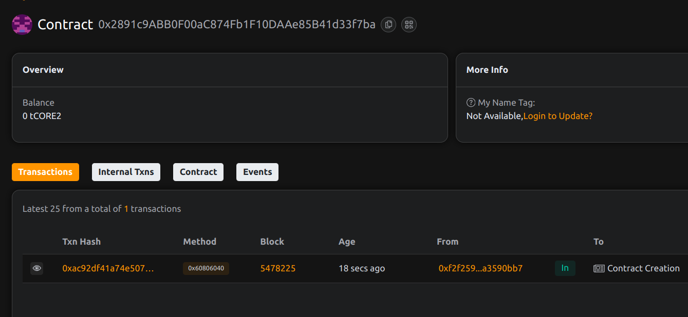

# StableFund – Algorithmic Treasury Management for Stable Token Pools

## 📄 Project Description

StableFund provides a decentralized vault for managing stable token liquidity. It allows users to deposit and withdraw stablecoins while enabling the treasury administrator to trigger rebalancing events based on market or strategic inputs.

## 🎯 Project Vision

To offer a robust, transparent, and programmable stable asset treasury that automatically optimizes holdings for safety, liquidity, and yield within DeFi ecosystems.

## ✨ Key Features

- 💼 Support for ERC-20 stablecoin deposits and withdrawals
- 🧠 Admin-triggered treasury rebalancing logic
- 📊 User-level balance tracking
- 🔐 Non-custodial and secure fund handling
- 💎 Optimized for low-volatility asset pools

## 🔮 Future Scope

- Integration with DeFi protocols (Aave, Compound, etc.)
- Automated rebalancing strategies (oracle-based)
- DAO-governed treasury policy
- Portfolio diversification with risk scoring

## 📜 Contract Details
0x2891c9ABB0F00aC874Fb1F10DAAe85B41d33f7ba
